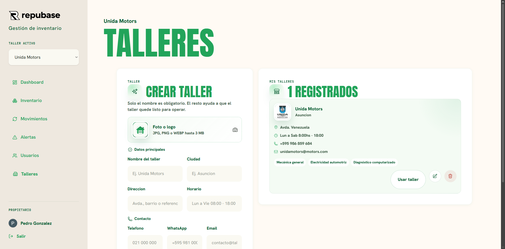

  

  

    La forma simple y profesional de controlar repuestos, stock y movimientos
    en talleres mecanicos.
  

  

    <a href="https://xmanugonzalez.github.io/repubase/"><strong>Ver Repubase</strong></a>
  

  
  
  
  
  
  
  
  

   
   

  

##  Orden para el inventario de tu taller

Repubase es una plataforma pensada para talleres mecanicos que necesitan saber,
sin vueltas, que repuestos tienen, donde estan, cuanto valen y como se mueve el
stock dia a dia.

En lugar de depender de planillas desactualizadas, mensajes sueltos o controles
manuales, Repubase centraliza la informacion importante del taller en una
experiencia clara, visual y facil de usar.

##  Lo que Repubase ayuda a resolver

| Problema | Como ayuda Repubase |
| --- | --- |
|  **Stock desordenado** | Cada repuesto queda registrado con sus datos clave. |
|  **Falta de trazabilidad** | Cada entrada, salida o ajuste queda documentado. |
|  **Repuestos olvidados** | Las alertas ayudan a detectar piezas con stock parado. |
|  **Informacion dispersa** | El equipo trabaja sobre una misma base de datos. |
|  **Control limitado** | El dashboard muestra el estado del inventario de un vistazo. |
|  **Crecimiento del taller** | Permite operar con varios talleres, usuarios y roles. |

##  Beneficios para el taller

| Beneficio | Impacto |
| --- | --- |
|  **Inventario mas claro** | Menos tiempo buscando piezas y mas control sobre lo disponible. |
|  **Movimientos ordenados** | Mejor seguimiento de entradas, salidas y ajustes de stock. |
|  **Alertas accionables** | Identificacion de repuestos que llevan demasiado tiempo sin rotar. |
|  **Trabajo por roles** | Cada persona accede a las acciones que necesita segun su funcion. |
|  **Vista general del negocio** | Datos clave del inventario visibles desde el dashboard. |

##  Tecnologias utilizadas

Repubase fue desarrollado con tecnologias modernas para ofrecer una experiencia
rapida, segura y facil de mantener:

- **Vite:** base de desarrollo web rapida y optimizada.
- **React:** interfaz interactiva para la gestion diaria del taller.
- **TypeScript:** mayor confiabilidad en la logica del producto.
- **Tailwind CSS:** estilos consistentes y adaptables a distintos dispositivos.
- **Supabase:** autenticacion, base de datos, permisos y almacenamiento.
- **PostgreSQL:** base de datos relacional para guardar inventario, talleres y movimientos.
- **pnpm:** gestion eficiente de dependencias del proyecto.
- **GitHub Pages:** publicacion web de la version desplegada.

##  Modulos principales

###  Inventario

Carga y organiza repuestos con nombre, categoria, estado, precio, ubicacion,
foto y detalles especificos segun el tipo de pieza.

###  Movimientos de stock

Registra entradas, salidas y ajustes para mantener un historial claro de lo que
ocurre con cada repuesto.

###  Alertas de stock parado

Detecta repuestos disponibles que llevan mas de 90 dias sin movimiento, para
ayudar a tomar mejores decisiones de compra, venta o rotacion.

###  Dashboard

Resume el valor del inventario, cantidad de repuestos, stock total, alertas
activas y ultimos movimientos del taller.

###  Talleres y usuarios

Permite gestionar varios talleres, sumar miembros al equipo y asignar roles para
mantener el control de la operacion.

##  Pensado para talleres que quieren trabajar mejor

| Ideal para | Necesidad |
| --- | --- |
|  Talleres mecanicos con inventario propio | Controlar repuestos disponibles y ubicaciones. |
|  Negocios que venden y usan repuestos | Registrar operaciones diarias sin perder informacion. |
|  Equipos con movimientos frecuentes | Mantener trazabilidad de entradas, salidas y ajustes. |
|  Administradores del taller | Ver el estado del stock sin revisar planillas. |
|  Talleres en crecimiento | Ordenar usuarios, roles e informacion. |

##  Una operacion mas clara, pieza por pieza

Con Repubase, el inventario deja de ser una lista dificil de mantener y se
convierte en una herramienta de gestion diaria. Cada repuesto tiene contexto,
cada movimiento queda registrado y cada alerta ayuda a cuidar mejor el capital
del taller.

  
  
<strong>Inventario de repuestos para talleres que quieren tener el stock bajo control.</strong>

  

    <a href="https://xmanugonzalez.github.io/repubase/"><strong>Entrar a Repubase</strong></a>
  

